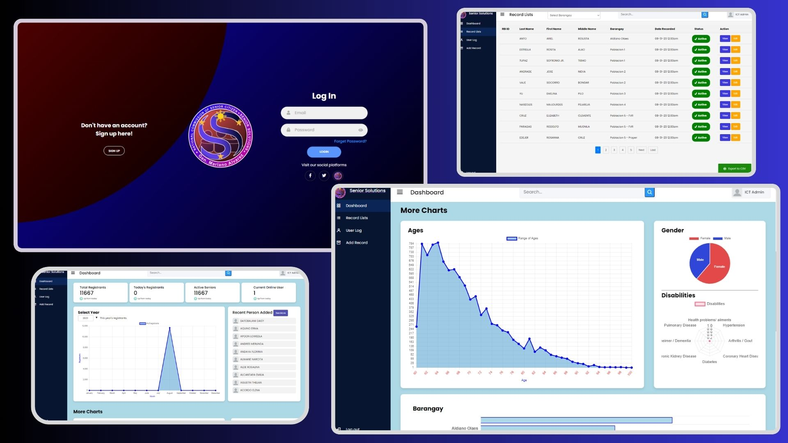

can't show the live demo because it has database :(

# SeniorDatabase

made with HTML,CSS,Javascript (inside the html), PHP and MySQL

must run in mysql, create a database name "senior",
import the sql file in the configuration folder and you're done.

admin credentials to log in:

email: ictgma@gmail.com 
password: ###ICTADMIN###

go to systemImageView to view the system.
